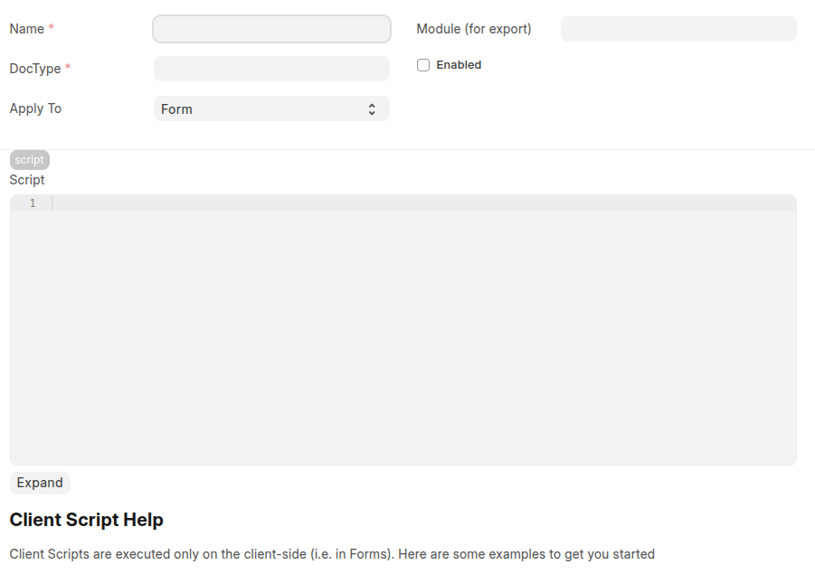
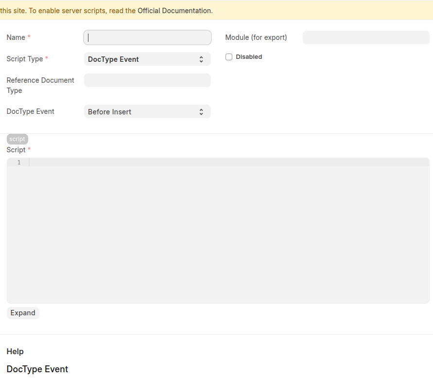

# Client Script

## What it is Client Script


Client Scripts run in the browser and control form behavior and UI interactions (validation, field visibility, custom buttons, client-side calculations).

## How to create

Path: **Home > Customization > Client Script**

**Main fields / options**

* **Name** — script name.
* **DocType** — the Doctype this script applies to.
* **Script** — JavaScript code that runs on the client.
* **Enabled** — toggle to activate the script.

## Example (Client-side JS)

Make `leave_type` required when `leave_days` > 1 and add a custom button:

```javascript
// Client Script for Doctype "Leave Application"

frappe.ui.form.on('Leave Application', {
  validate: function(frm) {
    if (frm.doc.leave_days > 1 && !frm.doc.leave_type) {
      frappe.msgprint('Leave Type required for more than 1 day');
      frappe.validated = false;
    }
  },
  refresh: function(frm) {
    frm.add_custom_button('Send Reminder', function() {
      frappe.call({
        method: 'frappe.client.set_value',
        args: { doctype: 'Leave Application', name: frm.doc.name, fieldname: 'reminder_sent', value: 1 },
        callback: () => frappe.msgprint('Reminder queued')
      });
    });
  }
});
```

---

# Server Script

## What it is Server Script



Server Scripts run on the server (Python) and handle backend logic: document events, scheduled jobs, custom API endpoints, permission queries, etc.

## How to create

Path: **Home > Customization > Server Script**

**Main fields / options**

* **Name** — script name.
* **Script Type** — common types: `Document Event`, `Scheduler Event`, `API`, `Permission Query` (UI may list types).
* **Reference Doctype / Event** — for Document Event scripts: choose the Doctype and the event(s) (e.g., `validate`, `before_save`, `on_submit`).
* **Script** — Python code executed on server.
* **Enabled** — toggle to activate.

## Example (Document Event — Python)

Auto-assign `approved_by` when a Leave Application is approved on submit:

```python
# Server Script: DocType = Leave Application, Event = on_submit

if doc.status == "Approved" and not doc.approved_by:
    doc.approved_by = frappe.session.user
    # optionally create an activity or notification
    frappe.msgprint(f"Approved by {doc.approved_by}")
```

## Example (API Server Script)

Create a simple API endpoint that returns current user:

```python
# Script Type: API

@frappe.whitelist(allow_guest=False)
def get_current_user():
    return {"user": frappe.session.user}
```

---

# Notes / Best Practices

* Use **Client Scripts** for UI/UX and immediate validation; keep them fast and avoid heavy logic.
* Use **Server Scripts** for data integrity, access checks, notifications, scheduled tasks, and any operation that must be trusted.
* Test scripts on a staging site before production.
* Prefer built-in hooks or custom apps for complex/large logic (better maintainability than many server scripts).

