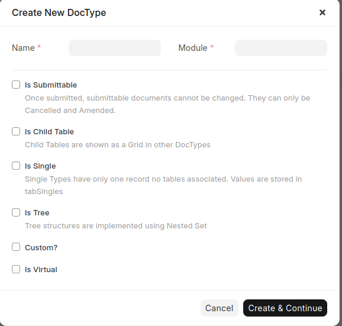

----------

### Required Fields:

1.  **Name***

    -   The name of your new DocType (e.g., `Invoice`, `Student`, `Task`).

    -   It becomes the table name internally (e.g., `tabInvoice`).

2.  **Module***

    -   The Frappe app/module where this DocType will belong (e.g., `Accounts`, `Education`, `CRM`).

    -   Helps organize and group related DocTypes.

----------

### Options / Checkboxes:

1.  **Is Submittable**

    -   Makes the DocType a _transactional document_ that can be “Submitted”.

    -   Once submitted, it **cannot be edited**; only canceled or amended (like a Sales Invoice, Purchase Order).

    -   Useful for approval workflows.

----------

2.  **Is Child Table**

    -   Makes this DocType a **child/line table** inside another DocType.

    -   Example: _Items table_ inside _Sales Invoice_.

    -   It will appear as a **grid** in the parent DocType.

----------

3.  **Is Single**

    -   The DocType will have only **one record ever** (no list view).

    -   Data is stored in `tabSingles`.

    -   Example: _Global Defaults_, _System Settings_.

    -   Used for storing configuration/settings.

----------

4.  **Is Tree**

    -   Allows the DocType to have a **hierarchical/tree structure** using Nested Sets.

    -   Example: _Chart of Accounts_, _Item Groups_, _Departments_.

    -   Useful when records have parent-child relationships.

----------

5.  **Custom?**

    -   Indicates if this DocType is **custom-created** by the user, not part of the core app.

    -   Checked automatically when you create a new DocType through the UI.

----------

6.  **Is Virtual**

    -   A **non-database DocType** (no physical table is created).

    -   Useful when you want to represent external/derived data (e.g., API-based data, reports).

    -   Used for advanced customizations.

----------

In short:

-   **Submittable** → For transactional docs.

-   **Child Table** → For nested tables inside other docs.

-   **Single** → For settings/config docs (one record only).

-   **Tree** → For hierarchical structures.

-   **Custom** → Marks it as a custom DocType.

-   **Virtual** → No DB table, used for computed or external data.

