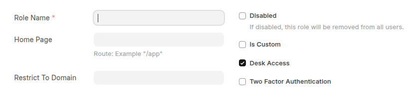
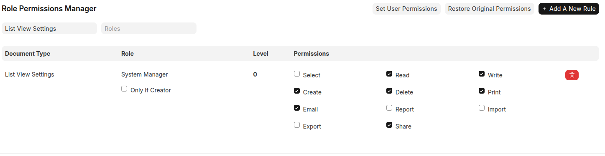

## What is a Role?

A **Role** is a label that defines user responsibilities. It does not directly give access but groups users for permissions.

---

## How to Create a Role

Path: **Users and Permissions > Role**

**Main Fields:**

* **Role Name** → Name of the role (e.g., Employee, Manager).
* **Desk Access** → If checked, role can access the Desk (full UI).
* **Two Factor Authentication** → Enforce 2FA for this role.
* **Disable Role** → To deactivate the role.

**Example:**

* Role: **Employee** → Desk Access enabled.
* Role: **Manager** → Desk Access + 2FA enabled.
* Role: **Portal User** → Desk Access disabled.

----

## What is Role Permission?

Defines what actions a role can perform on a specific **Doctype** (e.g., Leave Application). Managed through **Role Permission Manager**.

---

## How to Set Role Permissions

Path: **Users and Permissions > Role Permission Manager**

**Options Available:**

* **Document Type** → e.g., Leave Application.
* **Role** → e.g., Employee, Manager.
* **Permissions** → Read, Write, Create, Delete, Submit, Cancel, Amend, Print/Export, Email, Report.

---

## Example: Leave Application

| Role     |  Create | Submit | Approve/Reject |
| -------- |---------| ------ | -------------- |
| Employee | Yes     | Yes    | No             |
| Manager  | No      | No     | Yes            |
| HR User  | Yes     | Yes    | Yes            |

* Employee can submit their own leave.
* Manager can approve/reject.
* HR User has full access.

