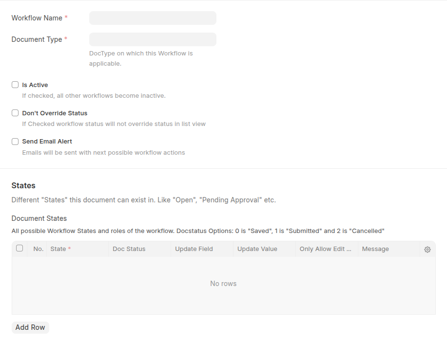

#  Workflow in Frappe

A **workflow** in Frappe is a system that defines the process flow of a document (like Sales Order, Leave Application, etc.) through various **states** and **actions** before reaching completion. It ensures that documents follow organizational approval rules, providing **control, transparency, and automation**.

---

## Components of Workflow

1. **Workflow**

    * The main configuration that ties everything together.
    * Linked to a specific **Doctype**.

2. **Workflow States**

    * Represents the status of the document at a given time.
    * Examples: *Draft → Pending Approval → Approved → Rejected*.

3. **Workflow Actions**

    * The possible actions that move a document from one state to another.
    * Examples: *Submit, Approve, Reject, Cancel*.

4. **Workflow Transitions**

    * The rules that connect states and actions.
    * Example: *If current state = Draft → Action = Submit → Next State = Pending Approval*.

5. **Roles**

    * Determines who can perform a particular action.
    * Example: *Only "Manager" role can Approve*.

6. **Document Status**

    * System-managed numeric status that helps identify the stage:

        * `0 = Draft`
        * `1 = Submitted`
        * `2 = Cancelled`

---

## Features of Workflow in Frappe

* **Custom Approval Flows** – Define state transitions as per business needs.
* **Role-based Permissions** – Ensure only authorized users can take actions.
* **Multi-level Approvals** – Support for multiple approval hierarchies.
* **Visual Representation** – Clear view of current state and possible actions.
* **Automation** – Integrates with notifications, assignments, and scripting.
* **Status Control** – Lock or restrict edits based on workflow state.
* **Reusability** – Multiple workflows can be created for different doctypes.

---

##  Key Parameters in Workflow Setup

When configuring a workflow in Frappe, you typically define:

* **Workflow Name** → A unique name for the workflow.
* **Document Type** → The doctype to which workflow applies.
* **Is Active** → Whether the workflow is currently active.
* **Workflow States**:

    * State name (e.g., Pending Approval)
    * Allow Edit (roles who can edit in this state)
    * Document status (0, 1, 2)
* **Workflow Actions**:

    * Action name (e.g., Approve, Reject)
* **Workflow Transitions**:

    * Current state
    * Action
    * Next state
    * Allowed role

---

## Example Workflow (Leave Application)

| Current State    | Action  | Next State       | Allowed Role |
| ---------------- | ------- | ---------------- | ------------ |
| Draft            | Submit  | Pending Approval | Employee     |
| Pending Approval | Approve | Approved         | Manager      |
| Pending Approval | Reject  | Rejected         | Manager      |
| Approved         | Cancel  | Cancelled        | Manager      |

