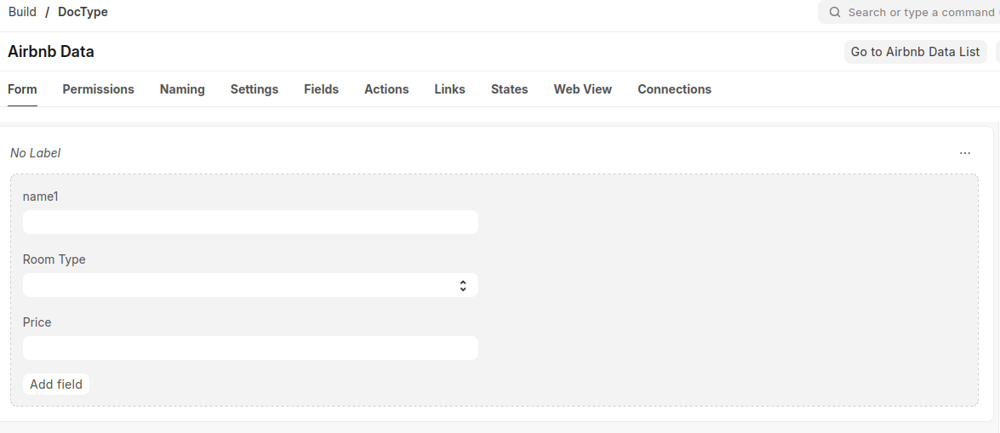

## What it is Virtual Doctype

A **Virtual Doctype** does not create a database table. It is used when you want to show computed data, integrate external APIs, or design forms that trigger actions without persisting records.

---

## How to create

1. Go to **Developer > DocType > New**.
2. Set **Is Virtual = Checked**.
3. Define fields (Data, Link, HTML, etc.).
4. Save.
5. Implement server methods to fetch data since there is no DB storage.


---

## Making List View work

For Virtual Doctypes, you must override methods in the DocType’s Python controller (`doctype/<my_virtual>/<my_virtual>.py`):

* `get_list(args)` → supplies records for List View.
* `get_count(args)` → returns record count for pagination.
* `get_doc(name)` → loads a single record for Form View.

imports
```python

from frappe.model.document import Document
from pymongo import MongoClient
from bson.objectid import ObjectId
from bson.decimal128 import Decimal128
```

connect to database
```
_client = None

def get_mongo_client():
    global _client
    if not _client:
        _client = MongoClient("mongodb://localhost:27017")
    return _client
```

```
class AirbnbData(Document):
    is_virtual = 1
```
```
    def load_from_db(self):
        client = get_mongo_client()
        col = client["sample_airbnb"]["listingsAndReviews"]
        doc = col.find_one({"_id": ObjectId(self.name)})
        if not doc:
            frappe.throw(f"MongoDB doc not found: {self.name}")

        self.room_type = doc.get("room_type")
        price = doc.get("price")
        self.price = float(price.to_decimal()) if isinstance(price, Decimal128) else price or 0
```
```
    @staticmethod
    def get_list(filters=None, page_length=20, start=0, **kwargs):
        client = get_mongo_client()
        col = client["sample_airbnb"]["listingsAndReviews"]
        results = list(col.find(filters or {}).skip(start).limit(page_length))

        return [{
            "name": str(r["_id"]),  # Required for routing
            "room_type": r.get("room_type"),
            "price": float(r.get("price").to_decimal()) if isinstance(r.get("price"), Decimal128) else r.get("price") or 0
        } for r in results]
```

```
    @staticmethod
    def get_count(filters=None, **kwargs):
        client = get_mongo_client()
        col = client["sample_airbnb"]["listingsAndReviews"]
        return col.count_documents(filters or {})
```

```
    @staticmethod
    def get_stats(**kwargs):
        return {}  # Optional, for dashboard summary etc.

    def db_insert(self, *args, **kwargs):
        pass

    def db_update(self, *args, **kwargs):
        pass

    def delete(self, *args, **kwargs):
        pass


```

---

## Example Use Cases

* Virtual report (e.g., stock summary from calculations).
* API wrapper (e.g., external users or orders).
* Temporary form (e.g., “Send Email” action) that triggers server logic.

---

## Key Notes

* No table is created in DB.
* Workflows and standard submission do not apply.
* Filtering, pagination, and ordering must be handled manually in `get_list`.
* Permissions can still be defined but have limited effect.

---