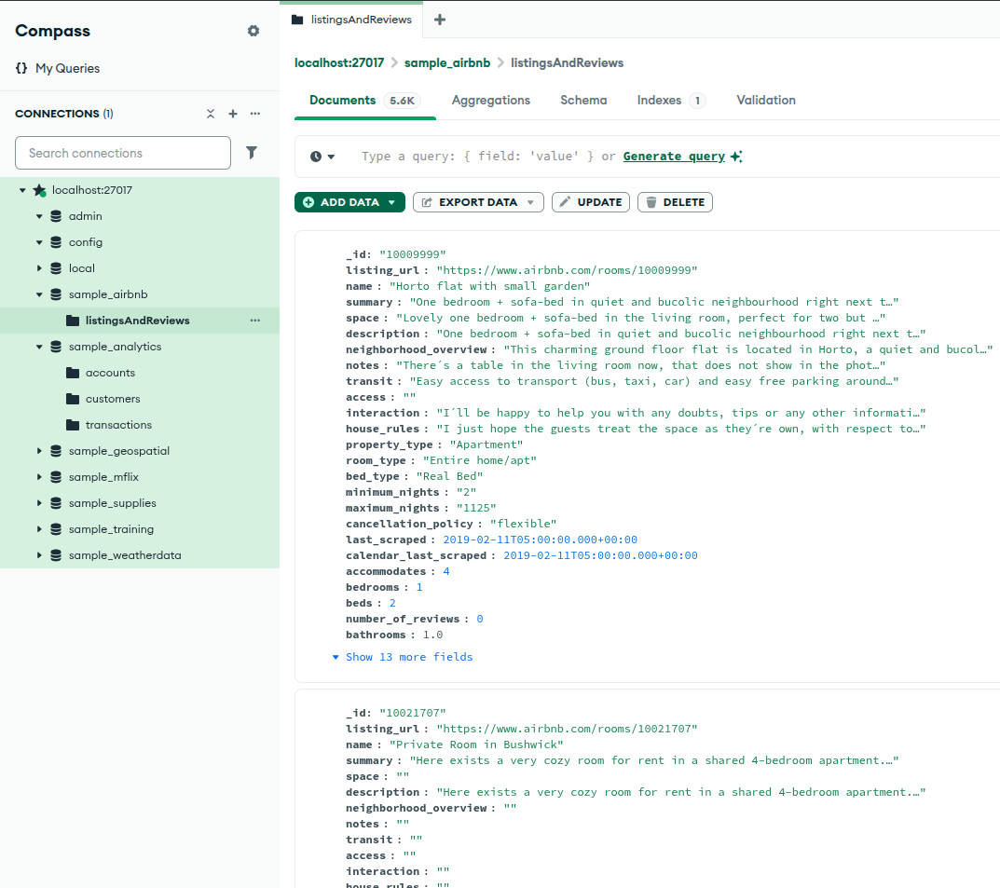

## requirements
these application should be installed and enabled before installing sample data [In ArchLinux](installing_mongodb.md)
> mongodb-bin mongosh-bin mongodb-tools-bin


### 1. clone the repo
```txt
git clone https://github.com/neelabalan/mongodb-sample-dataset.git
```
### 2. cd repo and run scritpt.sh
```txt
cd mongodb-sample-dataset
./script.sh
```

```txt

[inxeoz@manjaro-i3 | ~/mongodb-sample-dataset | 11:31:18 AM]$ ./script.sh
sample_airbnb
2025-09-23T11:31:20.394+0530	connected to: mongodb://localhost:27017/
2025-09-23T11:31:20.395+0530	dropping: sample_airbnb.listingsAndReviews
2025-09-23T11:31:21.615+0530	5555 document(s) imported successfully. 0 document(s) failed to import.
sample_analytics
---
---
2025-09-23T11:31:22.294+0530	11095 document(s) imported successfully. 0 document(s) failed to import.
sample_mflix
---
---
sample_supplies
---
---
sample_training
---
---
sample_weatherdata
2025-09-23T11:31:31.543+0530	connected to: mongodb://localhost:27017/
2025-09-23T11:31:31.543+0530	dropping: sample_weatherdata.data
2025-09-23T11:31:32.254+0530	10000 document(s) imported successfully. 0 document(s) failed to import.

[inxeoz@manjaro-i3 | ~/mongodb-sample-dataset | 11:31:32 AM]$
```

### Verifying using Mongodb compass


>? [more info](standard_installing.md)